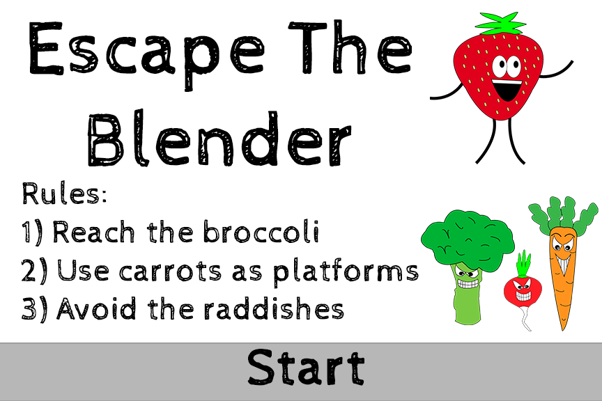
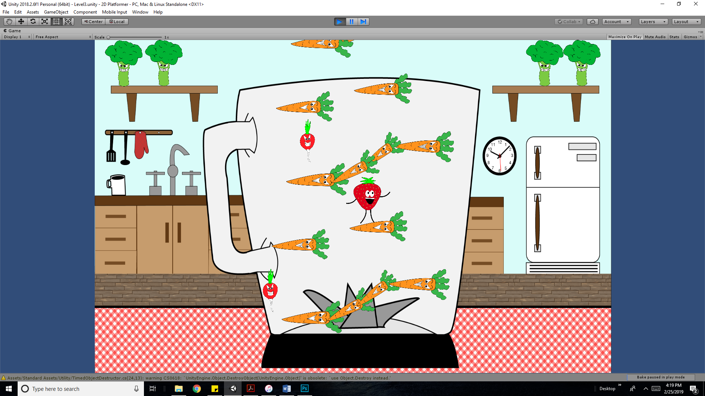

# Escape-The-Blender
A game where a strawberry must escape a blender from evil vegetables

## How To Run
This project can be run in two ways….
1)	This way to run the project is only possible on Windows OS. For this option, go to Builds/Windows and simply run the .exe file. Choose this option if you just want to run the game.
2)	If you have Unity installed, you can also download this whole project and open this game in Unity. This gives you the possibility to modify this game.

## How To Play

## In-Game Images

## Credits
